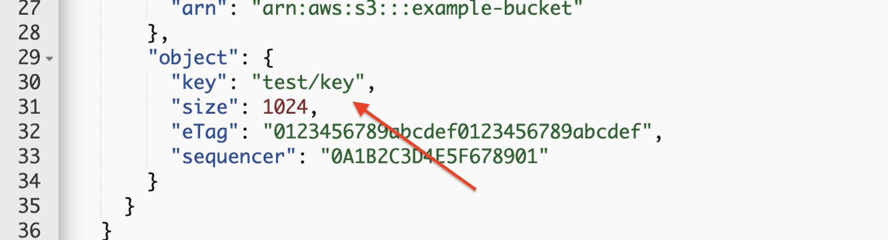

  
  
  

# Introduction to AWS Lambda

## LAB Overview

#### During this lab you'll learn to create a new AWS Lambda Function. It will also demonstrate how to start a Lambda function using events.

## Task 1: Creating S3 buckets

1. In the AWS Management Console, on the **Services** menu, click **S3**. 
2. Click **+Create bucket** button. 
3. Paste the name: **chm-studentX-uploads** 
4. Select Region: **EU (Ireland)** 
5. Click **Create** on the left. 
7. Upload [logo.jpg](logo.jpg) file to this bucket.
8. Click **+Create bucket** button. 
9. Paste the name: **chm-studentX-uploads-resized**. 
10. Select Region: **EU (Ireland)** 
11. Click **Create** on the left. 

Now you should have two buckets named sililiar to:
* bucket_name
* bucket_name-resized

## Task 2: Creating AWS Lambda Function

1.  In the AWS Management Console, on the **Services** menu, click **Lambda**. 
2.  Click **Create function**.
3.  Enter a name for function, e.g. *student-X-thumbnail-lambda*.
4.  As a **Runtime** choose **Python 3.6**.
5.  In **Permissions** unwind **Choose or create an execution role** and Select "Create a new role with basic Lambda permissions" in the Role menu.
6.  Click **Create function**.
7.  Download and save [Lambda package](CreateThumbnail.zip).
8.  Scroll down and in **Function code** undind **Code entry type** dropdown.
9.  Select **Upload a .zip file**.
10. Click **Upload**.
11. Select the file toy downloaded in step 7.
12. Change **Handller** to *CreateThumbnail.handler*.
13. Scroll down and set **Timeout** to 30 s.
14. Leave the rest unchanged and click **Save** at the top of the page.

## Task 3: Adding S3 permissions to the function IAM role

1.  Still in the lambda function configuration page scroll down, find **Execution role** pane and click **View the xxx role** it is under existing role.
2.  Click **Add inline policy**.
3.  Click **Choose a service**.
4.  Click **S3**.
5.  Unwind **Read** and mark the checkmark left to **GetObject**.
6.  Unwind **Write** and mark the checkmark left to **PutObject**.
7.  Click **Resources** and select **All resources**.
8.  Click **Review policy**.
9.  Add name and click **Create policy**.

## Task 4: Adding trigger to the function

1.  Back in lambda configuration page in the **Designer** click and select  **S3** as trigger.
2.  Select your first bucket as a **Bucket**.
3.  Make sure the trigger is enabled, leave the rest unchanged and click **Add**.
4.  Click **Save**.

## Task 5: Testing Lambda function

1.  At the top click **Test**.
2.  Select **Amazon S3 Put** as **Event template**.
3.  Edit sample payload. 
* Change bucket name and bucket arn.

* Change filename to *logo.jpg*.

4.  Enter a name for **Event name**.
5.  Click **Create**.
6.  Click **Test**.

At the top of the page you should see *Execution result: succeeded*. I anything went wrong there should be details explaining the cause of failure.

7.  Click **Details** and look into shown information.
8.  Click **Monitoring**.
9.  Click **View logs in CloudWatch**, find the latest log stream and read logs.
10. On the **Services** menu, click **Lambda**. 
11. Find your bucket containing resized images (the bucket witg '-resized' as suffix) and click on its name.
12. Select checkmark left to the filename, click **Download**.

The image should be a smaller thumbnail of the image.

13. Open your S3 bucket containing original images.
14. Upload any *jpg* file.
15. Check if there is any new file in *resized* bucket.

## END LAB

Please delete both S3 buckets and your Lambda function.

  

&copy; 2019 Chmurowisko Sp. z o.o.

